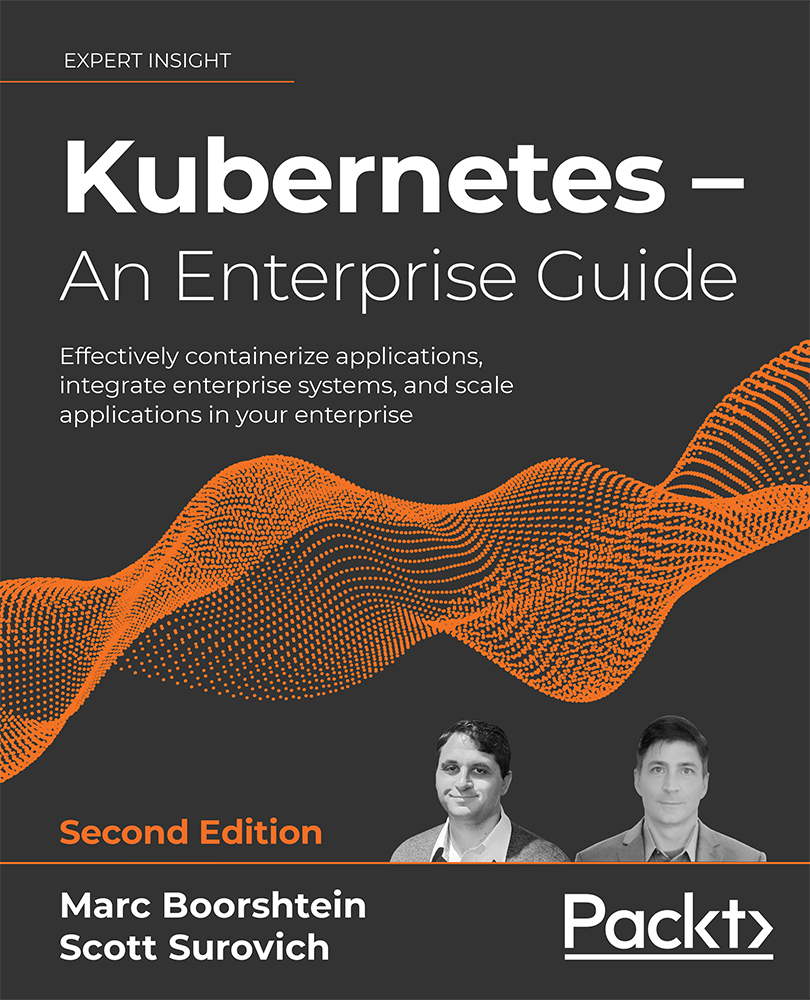

# Kubernetes: An Enterprise Guide, Second Edition, published by Packt

Note:  Chapter 3 does not have any exercises, therefore, you will not find any code or scripts in the repo for those chapters.  
  
Welcome to the repository for the Packt book, Kubernetes: An Enterprise Guide, Second Edition, created by Marc Boorshtein and Scott Surovich.  
  
This repo contains the scripts that are references in the book exercises.  You should clone this repo to the host you will use for the exercises included with the chapters.
Each chapter will explain the important portions of the scripts so you will have an understanding of what the scripts are executing.  While the scripts are not required, it will save your time over typing manifests manually. 

## Code Repository

Paperback: 578 pages  
Publisher: Packt Publishing 
Language: English

ISBN-10: 1803230037  
ISBN-13: 978-1803230030  
Kindle ASIN: B09FKKCXHG  

   
 

## Links

- <a href="https://amzn.to/3tDdJRk">Amazon link</a>
- <a href="https://packt.link/yYJ1i">Packt link</a>
- [Labs YouTube Channel](https://www.youtube.com/channel/UCK__yS63yrSI8vavJzainEQ) - Videos of all the labs from the book
  
 
  
# Required Experience  
You should have a basic understanding of Docker and Kubernetes before reading the book.  
  
# System Requirements  
Ubuntu 18.04 or 20.04 (20.04 is referenced in the exercises)  
4GB for most exercises, 8GB preferred  
5-10GB of free disk space on the Docker host system    
  
While the majority of the exercises can be executed on any system running Linux, the exercises in Chapter 12 may not execute correctly on a non-Ubuntu system.  
All other exercise should execute on CentOS or Ubuntu.

WSL2 and Docker were tested and most exercises will work correctly, however since Chapter 10 requires a kernel with eBPF support, the Falco pods may not start correctly.  
    
# Chapter Notes  
  
Chapter 4 contains a few complex topics that would require multiple virtual machines for any exercises.  We wanted to keep the required resources for readers to be low, allowing the majority of readers to complete the exercise steps.  This chapter has two topics that would require additional resources, the first is to fully configure external-dns, and the second, is K8GB.  
  
In this repository, you will find resources and scripts to deploy an example K8GB configuration.  These steps are outlined in the README file, located in the chapter 4 directory.  Since the project is evolving, the scripts and resources may need updating and if/when that happens, we will update the required resources.
### Download a free PDF

 <i>If you have already purchased a print or Kindle version of this book, you can get a DRM-free PDF version at no cost. Simply click on the link to claim your free PDF.</i>

 <a href="https://packt.link/free-ebook/9781803230030">https://packt.link/free-ebook/9781803230030 </a> 
